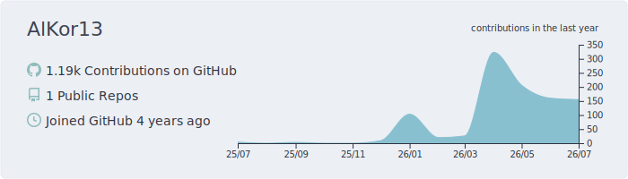
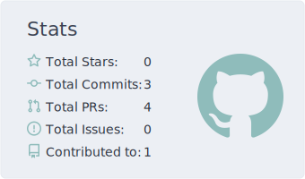
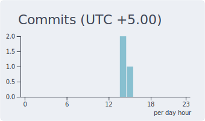

## 🧑‍💻 About me

- 🏥 Building ed-tech & automation for medical education
- 🔧 From frontend to `nginx -t` — I ship the whole thing: web apps, Telegram bots, CRM integrations, REST APIs

## 🚀 Tech stack

 

## 📊 Stats

<picture>
  <source media="(prefers-color-scheme: dark)" srcset="profile-summary-card-output/nord_dark/0-profile-details.svg" />
  
</picture>

<picture>
  <source media="(prefers-color-scheme: dark)" srcset="profile-summary-card-output/nord_dark/3-stats.svg" />
  
</picture>
<picture>
  <source media="(prefers-color-scheme: dark)" srcset="profile-summary-card-output/nord_dark/4-productive-time.svg" />
  
</picture>

## 🐍 Contribution snake

<picture>
  <source media="(prefers-color-scheme: dark)" srcset="https://raw.githubusercontent.com/AlKor13/AlKor13/output/github-contribution-grid-snake-dark.svg" />
  <source media="(prefers-color-scheme: light)" srcset="https://raw.githubusercontent.com/AlKor13/AlKor13/output/github-contribution-grid-snake.svg" />
  
</picture>

## 📫 Contact

